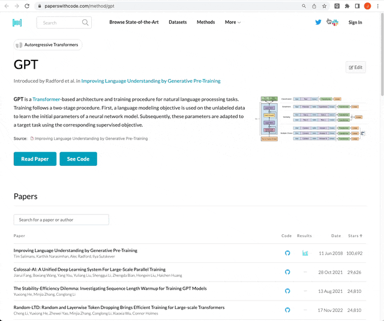

## QuicklyGPT

A Chrome extension that allows you to interact with ChatGPT right from page in view.

 

Further explanations can be found in this [medium post](https://medium.com/@jgleeee/quicklygpt-a-chrome-extension-to-save-your-time-a041805ebe77)

### Description
0. For installation, refer to the [chrome extention developer setup documentation](https://developer.chrome.com/docs/extensions/mv2/getstarted/)
1. First create and set your ChatGPT API key by clicking on the QuicklyGPT extension
2. Highlight the text from the current page that needs to be sent to ChatGPT
3. Add a further question/comment to the highlighted text
4. Wait for the ChatGPT response to be rendered below the input text field

### Reference
- [ChatGPT API documentation](https://platform.openai.com/docs/quickstart/build-your-application)
- [Chrome Extension explanation](https://plainenglish.io/blog/how-to-send-data-between-chrome-extension-scripts-1182ce67b659)
- [Chrome Extension storage](https://developer.chrome.com/docs/extensions/reference/storage/)